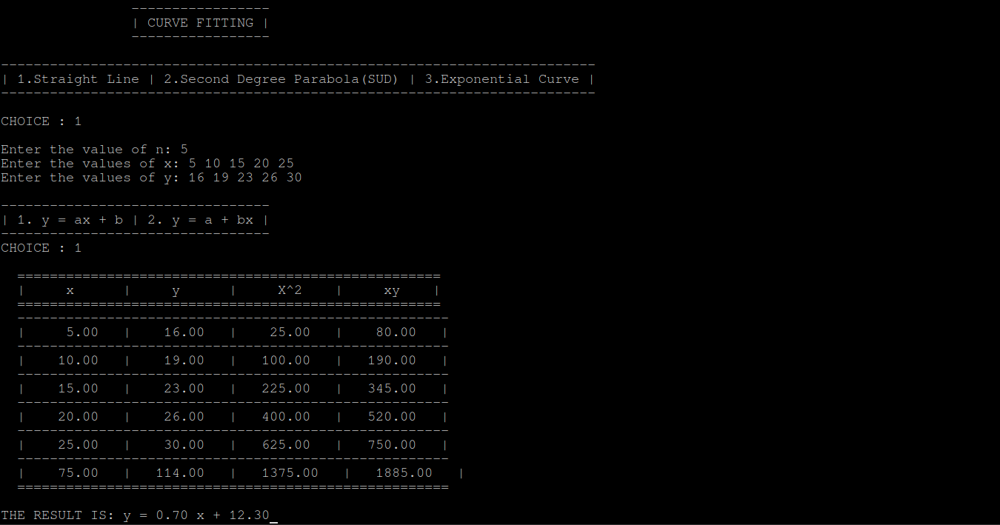
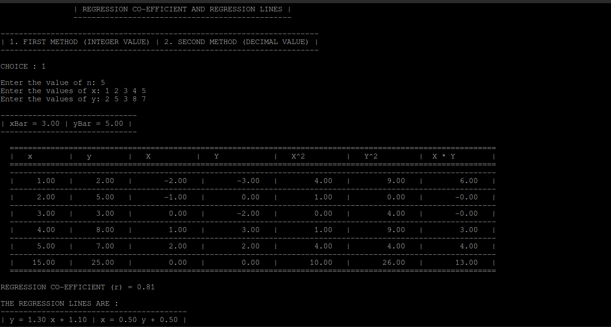

# C Library for numerical methods

This projects includes **C Programs** for various numerical methods such as curvefitting, regression co-efficient, R-K Method etc.

There will be a **C Library** with all the function of these programs.Some program outputs are shown below.

## How to run it?

This repo includes the generated object files with `base name with no extension` just open `objectFiles` folder and run this on command line or open the source file `(file name).c` in any IDE and execute it.

```
./base name with no extension
```

## Programs outputs

#### Curve fitting output



#### Regression coefficient output



More methods coming soon.
